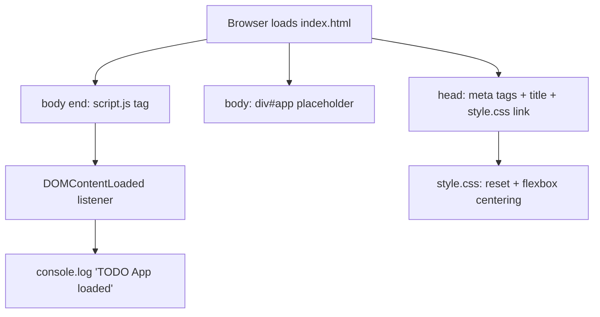

# Architecture: Project Setup & Base Structure

## Overview
This feature establishes the base file structure for the TODO App: a static `index.html` shell, a minimal `style.css` reset with centered flexbox layout, and a `script.js` file that confirms load via a console log. No task data, storage, or rendering logic is introduced in this ticket — it only lays the foundation that later stories (task creation, storage, rendering) will build on top of.

## Component Diagram

## Components & Responsibilities
| Component | File | Responsibility |
|---|---|---|
| UI Shell | index.html | Defines document structure: title, meta tags, link to style.css, empty `#app` container, script tag at end of body |
| Stylesheet | style.css | Applies minimal CSS reset (margin/padding/box-sizing) and centers `body` content via flexbox |
| Bootstrap Script | script.js | Listens for `DOMContentLoaded` and logs "TODO App loaded" to the console; no other logic in this ticket |

## LocalStorage Schema
Not applicable for this ticket — no data is persisted. LocalStorage usage is introduced in a later story once task management components exist.

## Event Flow
1. Browser requests `index.html`; parses `<head>` and applies the linked `style.css` (reset + flexbox centering on `body`).
2. Browser renders the empty `

` placeholder — no visible content, per NFR-1.
3. Browser reaches the `<script>` tag at the end of `<body>` and loads `script.js`.
4. `script.js` registers a `DOMContentLoaded` event listener.
5. Once the DOM is fully parsed, the listener fires and logs `"TODO App loaded"` to the console — no DOM mutation, no storage write.

## Technology Choices
| Choice | Technology | Rationale |
|---|---|---|
| Language | Vanilla JavaScript | Project constraint — no frameworks |
| Markup | HTML5 | Project constraint — static structure only |
| Styling | CSS3 (Flexbox) | Native centering without framework/layout libraries |
| Storage | LocalStorage (reserved, unused in this ticket) | Project constraint — no backend, deferred until task data exists |
| Script loading | `<script>` at end of `<body>` | FR-2/Q5 — avoids need for `defer`, guarantees DOM exists before parse |

## Trade-offs Considered
| Option | Why Rejected |
|---|---|
| `defer` attribute on a `<head>`-placed `<script>` | Requirements explicitly specify a script tag at the end of `<body>`, not `defer` in `<head>` (Q5) |
| CSS Grid for centering | Flexbox is simpler for single-container centering and explicitly required by FR-6 |
| Full CSS reset (e.g., normalize.css) | Out of scope — NFR-3 forbids external dependencies; only a minimal inline reset is required |
