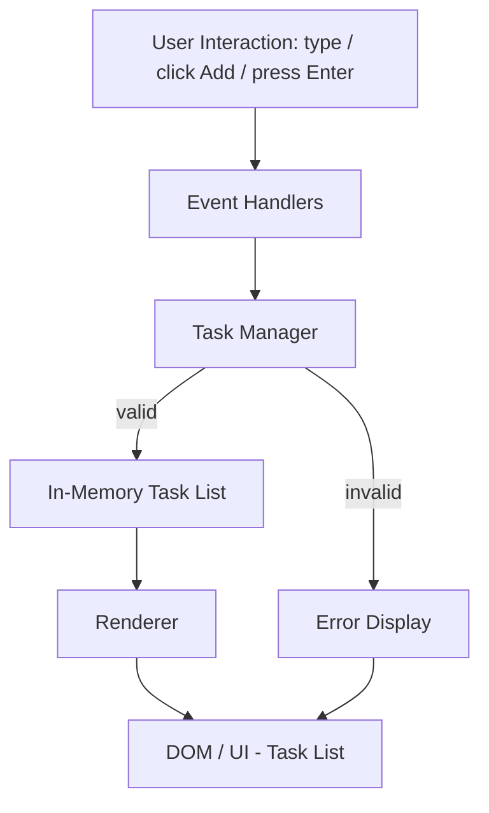
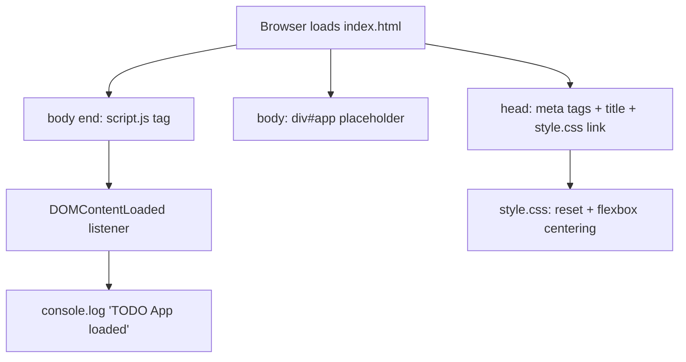

# Architecture: Add a Task

## Overview
This feature adds a text input, an "Add" button, and a task list to the existing `#app` container, letting a user type a task and add it to an in-memory list rendered on the page. Validation rejects empty/whitespace input with an inline error message; the list is not persisted to LocalStorage in this ticket.

## Component Diagram

## Components & Responsibilities
| Component | File | Responsibility |
|---|---|---|
| UI Layer | index.html | Adds a `<form id="task-form">` inside `#app` wrapping the text `<input>` and "Add" `<button type="submit">`; also includes an inline error element with `role="alert"` and an empty task list container (e.g. `<ul id="task-list">`) |
| Event Handlers | script.js | Listens for the form's single `submit` event (fired by both button click and Enter keypress) and calls `event.preventDefault()` before delegating to the Task Manager; clears the input on success |
| Task Manager | script.js | Validates input (rejects empty/whitespace-only), owns the in-memory task array, adds new tasks, triggers the Renderer or Error Display |
| Error Display | script.js | Owns the inline error message element (declared in index.html) and shows/hides it based on validation outcome |
| Renderer | script.js | Rebuilds the task list DOM from the in-memory task array whenever it changes; sets task text via `textContent` (never `innerHTML`) to prevent script injection from task content |

## LocalStorage Schema
Not applicable for this ticket — persistence is explicitly out of scope. Tasks are held only in an in-memory JavaScript array for the duration of the page session.

## Event Flow
1. User types text into the input field.
2. User clicks "Add" (submit button) or presses Enter — both natively trigger the form's `submit` event, handled by a single Event Handler.
3. Event Handler calls `event.preventDefault()` (blocking the default page navigation/reload), reads the input value, and passes it to the Task Manager.
4. Task Manager trims and validates the value:
   - If empty/whitespace-only: Task Manager signals the Error Display to show the inline error message; input is left untouched; no task is added.
   - If valid: Task Manager appends the task to the in-memory task array, clears any previously shown error message, and notifies the Renderer.
5. Renderer rebuilds the task list DOM from the in-memory array, assigning task text via `textContent`.
6. Event Handler clears the input field on successful add.

## Technology Choices
| Choice | Technology | Rationale |
|---|---|---|
| Language | Vanilla JavaScript | Project constraint — no frameworks |
| Storage | In-memory array (no LocalStorage) | Persistence explicitly out of scope per requirements |
| Markup | HTML5 form elements (`input`, `button`) | Native accessibility and keyboard (Enter key) support |
| Validation | Custom inline validation (not native `required`) | Requirement specifies a custom inline error element, not native browser validation |

## Trade-offs Considered
| Option | Why Rejected |
|---|---|
| Native HTML `required` attribute for validation | Requirement explicitly calls for a custom inline error message, not native browser validation UI |
| Separate click/keypress listeners instead of one `<form>` submit listener | Rejected — duplicates logic for FR-2 and FR-5 and risks inconsistent behavior; a single `submit` handler with `preventDefault()` covers both button click and Enter key natively |
| Persisting tasks to LocalStorage now | Explicitly out of scope for TODO-4; deferred to a future ticket |

---

# Previous: Project Setup & Base Structure (TODO-2, archived)

## Overview
This feature establishes the base file structure for the TODO App: a static `index.html` shell, a minimal `style.css` reset with centered flexbox layout, and a `script.js` file that confirms load via a console log. No task data, storage, or rendering logic is introduced in this ticket — it only lays the foundation that later stories (task creation, storage, rendering) will build on top of.

## Component Diagram

## Components & Responsibilities
| Component | File | Responsibility |
|---|---|---|
| UI Shell | index.html | `<!DOCTYPE html>` HTML5 document with `<html lang="en">`; defines document structure: `<title>TODO App</title>`, UTF-8/viewport meta tags, relative link to `style.css` (`href="style.css"`), empty `#app` container, relative script tag at end of body (`src="script.js"`) |
| Stylesheet | style.css | Applies minimal CSS reset (margin/padding/box-sizing) and centers `body` content via flexbox |
| Bootstrap Script | script.js | Listens for `DOMContentLoaded` and logs "TODO App loaded" to the console; no other logic in this ticket |

All asset references use paths relative to the repository root (no leading `/`), since the app is opened as a static file with no server — an absolute path would 404 and violate NFR-2.

## LocalStorage Schema
Not applicable for this ticket — no data is persisted. LocalStorage usage is introduced in a later story once task management components exist.

## Event Flow
1. Browser requests `index.html`; parses `<head>` and applies the linked `style.css` (reset + flexbox centering on `body`).
2. Browser renders the empty `

` placeholder — no visible content, per NFR-1.
3. Browser reaches the `<script>` tag at the end of `<body>` and loads `script.js`.
4. `script.js` registers a `DOMContentLoaded` event listener.
5. Once the DOM is fully parsed, the listener fires and logs `"TODO App loaded"` to the console — no DOM mutation, no storage write.
6. Verification: open `index.html` directly in a browser and confirm via DevTools that the console shows only the "TODO App loaded" log — no 404s, syntax errors, or warnings (NFR-2).

## Technology Choices
| Choice | Technology | Rationale |
|---|---|---|
| Language | Vanilla JavaScript | Project constraint — no frameworks |
| Markup | HTML5 | Project constraint — static structure only |
| Styling | CSS3 (Flexbox) | Native centering without framework/layout libraries |
| Storage | LocalStorage (reserved, unused in this ticket) | Project constraint — no backend, deferred until task data exists |
| Script loading | `<script>` at end of `<body>` | FR-2/Q5 — avoids need for `defer`, guarantees DOM exists before parse |

## Trade-offs Considered
| Option | Why Rejected |
|---|---|
| `defer` attribute on a `<head>`-placed `<script>` | Requirements explicitly specify a script tag at the end of `<body>`, not `defer` in `<head>` (Q5) |
| CSS Grid for centering | Flexbox is simpler for single-container centering and explicitly required by FR-6 |
| Full CSS reset (e.g., normalize.css) | Out of scope — NFR-3 forbids external dependencies; only a minimal inline reset is required |
